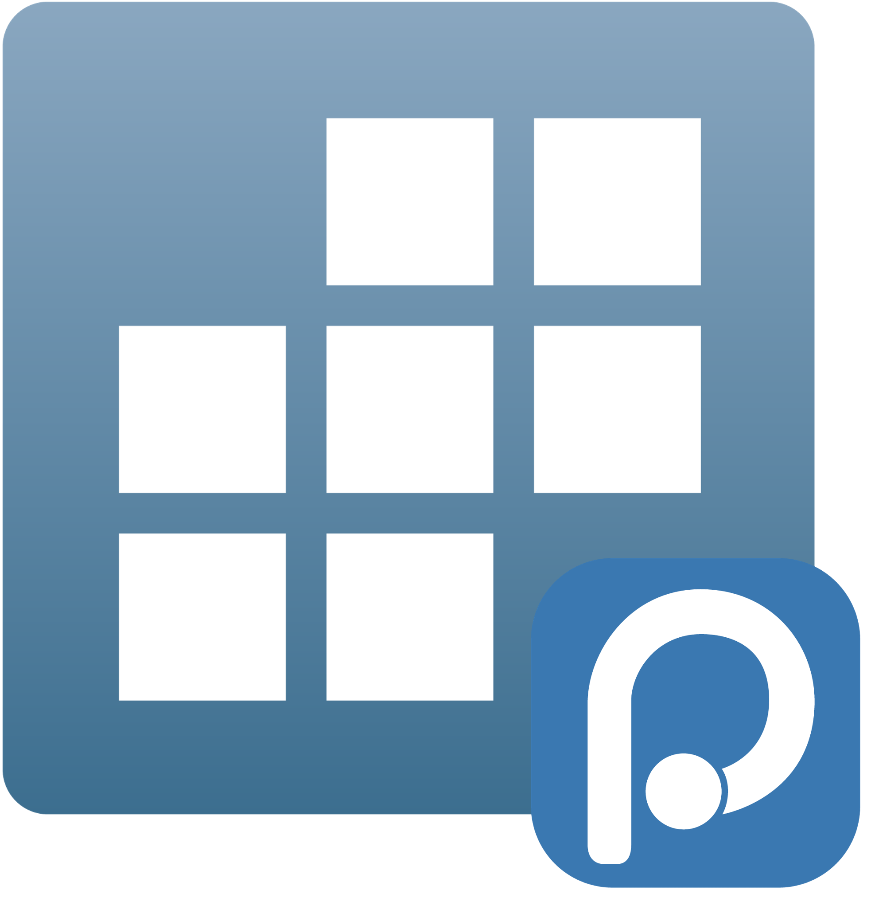

<a href="https://github.com/ntluong95/positron-stata" class="btn" role="button"> Code</a>

# STATA for Positron

`positron-stata` is a Positron-native Stata extension that preserves the proven Python MCP and session logic from [`hanlulong/stata-mcp`](https://github.com/hanlulong/stata-mcp) while replacing the outer extension shell with the runtime/session architecture compatible with Positron IDE.

{.img-center width=15em fig-alt="extension logo"}

## Key Features

### Console

Interactive Stata console backed by the MCP server, showing session startup and the prompt for running commands.

### Data Explorer

Interactive data viewer showing variables, brief summaries and a spreadsheet-like table for `browse` output. It also support display variable label as a tooltip, summary statistics and filtering data

### DO-file Editor & Syntax

Stata `.do` file editor with syntax highlighting, inline execution controls, and integrated results.

Add a completion provider per Trigger sugestion, providing variable list and label

### Environment & Plots

Session variables and Plots pane — exported Stata graphs render directly inside Positron.

### Help Pane

Rendered Stata help topics with syntax, options and examples available inline in the Help pane.

### History

Command history panel that preserves executed commands and can re-run or send commands back to the console.

### Inline Output (Quarto)

Preview of Stata output embedded inline in Quarto (.qmd) documents — rendered code results and plots appear directly alongside narrative text.

## Requirements

- Positron IDE with extension API support compatible with VS Code `^1.99.0`
- Stata 17 or later installed locally
- Node.js and npm for extension development
- Python 3.9+ plus `uv` for the bundled server environment

On first launch the extension can provision its own Python environment via [`python/check-python.js`](./python/check-python.js). The script prefers `uv`, creates `.venv`, installs [`python/requirements.txt`](./python/requirements.txt), and stores the resolved interpreter in `.python-path`.

## Attribution And Licensing

This project intentionally reuses upstream logic from `hanlulong/stata-mcp`.
